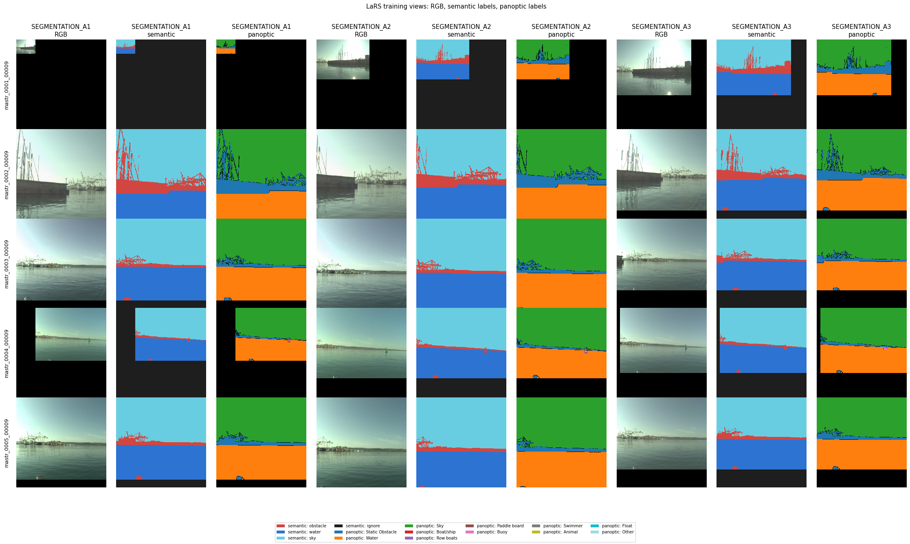

# Vision Pipelines

`justdata.vision` is the image modality package for TensorFlow-native loading, schema normalization, augmentation,
batching, metadata, presets, and corruption benchmarks.

Shared bounded prefetch, CPU placement, and protected cache controls are documented in the
[usage guide](../README.md#bounded-input-execution-and-protected-caches). For dense inputs, include the resolved
geometry and ignore conventions in the cache fingerprint and use a finite batch/prefetch profile.

Current pipeline support covers image classification, semantic segmentation, and panoptic segmentation. Object detection
and depth estimation remain future scope and are not registered capabilities.

## 1. Why justdata owns image transforms

Vision checkpoints and training recipes assume exact preprocessing semantics: image decoding shape, channel order,
resize and crop policy, interpolation, pixel range, normalization, label transform, tensor layout, and evaluation views.
If those steps live outside the data pipeline, training and evaluation can silently drift from the model contract.

`justdata` owns image transforms so a preset can describe the full input contract in one hashable object and so
TensorFlow, JAX/NumPy consumers, preset contract tests, and corruption benchmarks all use the same preprocessing path.

## 2. Vision canonical schema

Raw or adapted vision samples use these keys:

| Key             | Meaning                                                                               |
| :-------------- | :------------------------------------------------------------------------------------ |
| `image`         | Image tensor in HWC layout before postprocessing.                                     |
| `label`         | Optional class index, dense vector, or task target.                                   |
| `mask`          | Optional segmentation mask.                                                           |
| `panoptic_mask` | Optional HW segment-ID map for panoptic segmentation.                                 |
| `segments`      | Optional panoptic segment table with category and crowd flags.                        |
| `depth`         | Optional depth map.                                                                   |
| `bboxes`        | Optional object detection boxes.                                                      |
| `metadata`      | Optional nested metadata such as dataset, split, filename, example id, or class name. |

Classification pipelines always preserve unknown keys unless a stage explicitly owns them. Metadata handling is shared
with acoustic through `justdata.core`.

## 3. Four vision pipeline stages

Vision pipelines use the same four callables as acoustic:

```python
(preprocess_fn, augment_fn, late_augment_fn, postprocess_fn)
```

The loader executes them as:

```text
fetch_ds -> adapter -> preprocess -> cache -> augment -> shuffle -> postprocess -> batch -> late_augment -> pad -> prefetch
```

`cache_dataset/cache_path` controls the pre-augment cache. It is disabled by default: set `cache_dataset=True` with an
empty path for an intentional memory cache, or provide a nonempty filesystem path. Large datasets should use an explicit
disk path or remain uncached. This choice affects performance, not output values, and is separate from source-owned
download caches under `data_dir`. For ViT fine-tuning on large datasets, `cache_model_inputs/model_input_cache_path` can
additionally cache resized and normalized model inputs after postprocess. Training use requires
`allow_train_model_input_cache=True`; use it only for deterministic training views because stochastic augmentation is
cached on first fill.

For vision classification the stages are:

| Stage          | Vision responsibility                                                                                                 |
| :------------- | :-------------------------------------------------------------------------------------------------------------------- |
| `preprocess`   | Normalize image rank and channels before cache.                                                                       |
| `augment`      | Training-only per-sample crop, flip, RandAugment, TrivialAugment, ColorJitter, or SSL multi-crop.                     |
| `postprocess`  | Deterministic resize/crop for eval, tensor normalization, layout conversion, one-hot labels, and hard-label metadata. |
| `late_augment` | Training-only batch transforms such as Mixup, CutMix, and random erasing.                                             |

For segmentation, RandAugment, TrivialAugment, and TrivialAugmentWide apply each sampled rotation, shear, or translation
to the image and `mask` together. Images use bilinear interpolation while masks use nearest-neighbor interpolation,
preserving discrete class values and mask dtype. Pixels exposed outside the transformed mask use `mask_fill_value` from
`make_augmentations` (default `255`); the training loss must ignore the chosen fill label. Photometric policy operations
modify only the image. Custom registered augmentation strategies remain image-only and therefore must not perform
geometry when used by the segmentation pipeline.

Classification crop strategies receive common `image_size`, `seed`, `interpolation`, `padding`, and `pad_mode` values
from `make_augmentations`. Strategy-specific values belong in `crop_kwargs`; common keys are rejected there rather than
silently overriding the top-level configuration. `random_resized_hvflip` performs a random resized crop followed by
independent stateless horizontal and vertical flips:

```python
fmow_m1_aug_kwargs = {
    "enable": True,
    "image_size": 224,
    "crop_type": "random_resized_hvflip",
    "interpolation": "bicubic",
    "crop_kwargs": {
        "scale": (0.85, 1.0),
        "ratio": (0.90, 1.10),
        "horizontal_flip_probability": 0.5,
        "vertical_flip_probability": 0.5,
    },
}
```

The input seed is split in crop, horizontal-flip, vertical-flip order. Neither the strategy nor its registry metadata
requires labels. Existing presets omit `crop_kwargs` and retain their prior hashes and behavior.

## 4. How to choose a preset

Choose the preset that matches the dataset scale and model recipe:

| Use case                                       | Prefer                                                                                                                  |
| :--------------------------------------------- | :---------------------------------------------------------------------------------------------------------------------- |
| CIFAR-10 or CIFAR-like 32 px classification    | `cifar` through `dataset="cifar10"`.                                                                                    |
| CIFAR-100 32 px classification                 | `cifar100`.                                                                                                             |
| Standard ImageNet-style ViT or ConvNeXt recipe | `_default` through `dataset="imagenet"`.                                                                                |
| Legacy ImageNet ResNet recipe                  | `imagenet_resnet`.                                                                                                      |
| ResNet Strikes Back recipes                    | `imagenet_a1`, `imagenet_a2`, or `imagenet_a3`.                                                                         |
| Semantic or panoptic segmentation              | `segmentation_a2` by default; `segmentation_a3` is lighter and `segmentation_a1` uses large scale jitter.               |
| DINOv2-style self-supervised multi-crop        | `dinov2`.                                                                                                               |
| WILDS image classification                     | Benchmark defaults: `wilds:camelyon17`, `wilds:fmow`, `wilds:iwildcam`, or `wilds:rxrx1`. Strong opt-ins add `_strong`. |

Use `justdata.vision.presets.get_resolved_preset(name).hash()` in experiment metadata. A changed hash means the image
preprocessing or augmentation contract changed.

## 5. WILDS source loading

Install `justdata[wilds]` and import `justdata.vision` before resolving WILDS pipelines. WILDS datasets use the same
`load_ds` syntax as TFDS and Hugging Face sources:

```python
local_ssd = "/local_ssd/justdata"
wilds_ds = "wilds:fmow?split_scheme=time_after_2016"
pipeline = get_pipeline(dataset="wilds:fmow")

ds, n = load_ds(
    dataset_names_arg=[wilds_ds],
    splits_arg={wilds_ds: ["train"]},
    dataset_type="train",
    batch_size=32,
    seed=0,
    pipeline=pipeline,
    num_classes=62,
    data_dir=f"{local_ssd}/sources",
    cache_dataset=True,
    cache_path=f"{local_ssd}/decoded/fmow-train",
    cache_model_inputs=True,
    model_input_cache_path=f"{local_ssd}/model-inputs/fmow-train-224",
    allow_train_model_input_cache=True,
    metadata_mode="numeric_only",
)
```

For remote/downloaded sources, `data_dir` is a cache root. justdata namespaces source-owned caches under it, for example
`hf/vision/`, `wilds/`, and `zenodo/`. If omitted, the root is `~/.cache/justdata`.

Zenodo sources accept only positive numeric record IDs, basename-only archive names, and HTTPS downloads from
`zenodo.org`. Downloads have a 60-second network-operation timeout, a one-hour overall deadline, and a 20 GiB archive
limit; a provider-declared size must match exactly, and a declared checksum is verified before the cache file is
atomically installed. ZIP and TAR extraction accepts only regular files and directories, rejecting links, special files,
duplicate destinations, and path escapes. Extraction is preflighted against a 100,000-member limit, a 100 GiB
expanded-size limit, and available cache-disk space. Per-archive interprocess locking and unique staging paths make
concurrent cache preparation safe. These checks bound resource use and filesystem effects; checksums establish provider
integrity but do not make image contents trusted. Before TensorFlow decoding, each image header is checked with Pillow
and rejected if the encoded file exceeds 256 MiB, either dimension exceeds 32,768 pixels, or the decoded image exceeds
64 million pixels.

The base `wilds:fmow` preset is deterministic during training, so the explicit train model-input cache above is suitable
for local SSD benchmarking. Use `cache_dataset/cache_path` alone for stochastic presets such as `wilds:fmow_strong`,
unless freezing the first sampled augmentations is desired.

Supported WILDS datasets are image classification only: Camelyon17, FMoW, iWildCam, and RxRx1. FMoW temporal drift
testing uses WILDS split schemes such as `?split_scheme=time_after_2016`. Labeled and unlabeled splits must be loaded in
separate `load_ds` calls.

WILDS downloads are disabled by default (`download=false`). To let WILDS download the dataset under `data_dir/wilds`,
add `download=true` to the dataset string. Use `&` between query options:

```python
wilds_ds = "wilds:fmow?split_scheme=time_after_2016&download=true"
```

For datasets without other options, use:

```python
wilds_ds = "wilds:camelyon17?download=true"
```

FMoW can opt into authoritative source metadata for inventory and grouping workflows:

```python
from justdata.core import fetch_ds

fmow = (
    "wilds:fmow?split_scheme=official&version=1.1&download=false"
    "&source_metadata=location_id,timestamp"
)
source_ds = fetch_ds([fmow], {fmow: ["train", "id_val", "id_test", "val"]})

for sample in source_ds.as_numpy_iterator():
    location_id = sample["metadata"]["wilds_source"]["location_id"]
    timestamp = sample["metadata"]["wilds_source"]["timestamp"]
```

`source_metadata` accepts only `location_id` and `timestamp`, in any comma-separated subset. Both are scalar `tf.string`
values and therefore appear as UTF-8 bytes from `as_numpy_iterator()`. `location_id` is the exact FMoW
sequence-directory basename retained in the raw WILDS `img_path` (for example, `airport_0`); it is not derived from
coordinates, regions, or `wilds_index`. `timestamp` preserves the source ISO-8601 text exactly, including `Z`, explicit
timezone offsets, and fractional seconds.

JustData aligns these values by applying WILDS' `full_idxs` public-to-raw mapping before reading the raw metadata table.
Source construction fails if the installed WILDS dataset lacks a reliable mapping, required column, valid sequence path,
or timezone-aware timestamp. Unknown fields, duplicates, and target-equivalent fields such as `y` and `category` are
rejected; arbitrary raw metadata columns are never exposed. Without `source_metadata`, the output signature is unchanged
and `metadata["wilds_source"]` is absent.

The source inventory returned by `fetch_ds` always contains requested source metadata. In model-input pipelines,
`metadata_mode="full"` preserves it, `metadata_mode="numeric_only"` removes the string-only `wilds_source` mapping, and
`metadata_mode="none"` removes all metadata.

## 6. CIFAR, ImageNet, DINOv2, and WILDS preset contracts

CIFAR presets use 32 px inputs, random padded crop, horizontal flip, TrivialAugmentWide, CIFAR-specific normalization,
`bchw` model layout, and classification labels.

ImageNet default presets use 224 px inputs, random resized crop during training, deterministic resize and center crop
during evaluation, ImageNet mean/std normalization, `bchw` model layout, RandAugment or ColorJitter depending on the
recipe, and optional batch mixing.

ResNet Strikes Back presets (`imagenet_a1`, `imagenet_a2`, `imagenet_a3`) encode the recipe-specific augmentation
strength, Mixup/CutMix settings, validation resize behavior, and train/eval resolution policy.

DINOv2 uses asymmetric multi-crop training with global and local crops while keeping the downstream evaluation path
deterministic.

WILDS benchmark presets keep the reference input policy and avoid broad ImageNet-style training recipes by default:
Camelyon17 uses 96 px ImageNet normalization, FMoW uses 224 px ImageNet normalization, iWildCam uses 448 px ImageNet
normalization, and RxRx1 uses 256 px inputs with per-image per-channel standardization plus train-only 90-degree
rotations and horizontal flips.

Opt-in WILDS `_strong` presets keep the same input sizes but add stronger training augmentation. Camelyon17 uses mild
color jitter with rotation/flip, FMoW and iWildCam use resize/flip plus RandAugment, and RxRx1 adds random erasing while
keeping per-image normalization. Mixup and CutMix stay disabled for WILDS presets unless the caller explicitly overrides
them.

## 7. Evaluation split safety

Vision pipelines keep training-only stochastic transforms out of validation and test views.
`load_ds(..., dataset_type="validation")` builds the pipeline with `is_training=False`, so evaluation uses deterministic
resize/crop behavior and no Mixup, CutMix, random erasing, or training crop randomness.

When computing validation metrics or corruption benchmarks, use `dataset_type="validation"` and `deterministic=True` if
the input order must be stable.

## 8. Metadata modes for JAX

`load_ds(..., metadata_mode=...)` is shared by vision and acoustic:

| Mode           | Behavior                                               |
| :------------- | :----------------------------------------------------- |
| `full`         | Keep all metadata, including strings.                  |
| `numeric_only` | Keep numeric metadata and remove strings from batches. |
| `none`         | Drop metadata from output batches.                     |

Use `metadata_mode="numeric_only"` with `as_numpy=True` for JAX-friendly arrays. If string metadata is needed for later
joins, pass `sidecar_metadata_path="metadata.jsonl"` and keep batches numeric. Each real row then carries
`metadata.row_id` (`int64`), which joins to the complete source mapping, and a numeric `metadata.row_fingerprint` that
detects stale cached mappings. Test `padding_mask` before looking up keys: padded rows have no identity, even if their
zero fill matches a real key.

For a finite source, build `MetadataSidecar.from_metadata(source_records)` or `MetadataSidecar.from_inventory(admitted)`
before iteration and pass it as `metadata_sidecar=` to `load_ds`, `load_inventory`, or `finalize_dataset`.
`from_metadata` takes source metadata dictionaries with an integer/string `example_id` or `dataset`, `split`, and
`clip_id`. The inventory helper also retains admitted source, split, record ID, verified assets, and supplied record
metadata. The mapping is detached when the dataset is built, so iteration, shuffle, caches, and restart do not create
its entries. Save it with `sidecar.write_jsonl(path, policy="create")` and read it with
`MetadataSidecar.read_jsonl(path)`. A full digest is available as `sidecar.digest()` and appears in executed
configuration snapshots.

The streaming path writes static source metadata before transforms. Its default `sidecar_metadata_policy="resume"`
validates and keeps accepted mappings; `"create"` fails if a file exists and `"overwrite"` explicitly replaces it. New
records are committed by atomic JSONL replacement. Repeated IDs with identical metadata are accepted; conflicting
metadata or numeric-key collisions fail. An older sidecar remains readable, but entries without complete identity
evidence cannot be used as an immutable mapping. Streaming sidecars may be partial if iteration stops early. Each new
record rewrites the JSONL atomically, so use the precomputed route for large finite inventories. Use one writer process
per path.

Keep geometry for each crop in the emitted numeric `geometry` record. It may change between epochs without changing the
source identity or sidecar entry. When a stage adds string metadata for a distinct view, the batch also carries
`metadata.view_id` and `metadata.view_fingerprint`. Join `(row_id, view_id)` to `sidecar.view_records` for that view's
metadata. A zero `view_id` means no string view record; numeric view geometry remains in the batch. For an immutable
sidecar, register known string views with `sidecar.add_view_metadata(row_id, view_metadata)` before building the
dataset. Unknown views fail explicitly.

## 9. Golden compatibility tests

Vision preset contracts live in `tests/test_vision_preset_contracts.py`. They pin preset hashes, model input fields,
normalization, static shapes, and deterministic validation postprocessing.

Optional external-reference golden tests should be marked `golden` and placed under a vision-specific test file when a
reference implementation is available, for example torchvision/timm preprocessing parity for a named ImageNet recipe.

## 10. Versioned image corruptions

Versioned decoded-image corruptions are registered by exact `(name, version)`.
`get_corruption_descriptor(name, version)` returns an immutable descriptor made only from plain Python values. It
records input/output domains, supported dtype, same-shape policy, ordered severity values and parameters, randomness and
seed contract, clipping/rounding, and the TensorFlow implementation identity. `list_corruption_descriptors()` enumerates
descriptors in stable name/version order.

The public low-level API requires an exact version and a complete stateless `int32[2]` seed:

```python
import tensorflow as tf

from justdata.vision.corruptions import apply_corruption

shifted = apply_corruption(
    decoded_rgb_uint8,
    name="gaussian_noise",
    version="1.0.0",
    severity=3,
    seed=tf.constant([123, 456], dtype=tf.int32),
)
```

It accepts decoded RGB `uint8` HWC for the five versioned operators and returns RGB `uint8` HWC with the same spatial
shape. It is compatible with `tf.function` and `tf.data.Dataset.map`; no global RNG is read. `gaussian_noise@1.0.0` uses
the explicit TensorFlow Philox algorithm. The non-random operators validate and ignore the supplied seed.

The version-`1.0.0` severity contracts are:

| Name                   | Severity 1–5 parameter                                        |
| :--------------------- | :------------------------------------------------------------ |
| `gaussian_blur`        | Gaussian sigma in pixels: `0.5, 1.0, 2.0, 3.0, 4.0`           |
| `gaussian_noise`       | Unit-range standard deviation: `0.01, 0.02, 0.04, 0.08, 0.16` |
| `jpeg_compression`     | JPEG quality: `90, 75, 55, 35, 15`                            |
| `contrast_reduction`   | Factor around `127.5`: `0.9, 0.75, 0.6, 0.45, 0.3`            |
| `brightness_reduction` | Factor: `0.9, 0.8, 0.7, 0.6, 0.5`                             |

Gaussian blur uses a normalized float32 kernel with radius `ceil(3 * sigma)`, TensorFlow depthwise convolution, and
reflect-101 borders. Float outputs clip to `[0, 255]`, round half to even with `tf.math.rint`, and cast to `uint8`. JPEG
uses RGB encode, chroma downsampling, no optimization, no progressive mode, three-channel decode, fancy chroma
upscaling, and the `INTEGER_ACCURATE` DCT hint. JPEG bytes are repeatable for a fixed TensorFlow/codec build;
cross-version codec byte parity is not part of the `1.0.0` guarantee and downstream environment locks remain part of a
scientific identity.

The legacy Mini-C names `noise`, `blur`, `weather`, and `digital` are also described as `1.0.0`, retain float-or-uint8
`[0, 255]` input compatibility and their prior truncate-on-cast numerical behavior, and remain available through
`apply_minic_corruption`.

`create_minic_datasets` forks the preprocessed RGB dataset, applies corruption before resize, float conversion,
normalization, batching, and padding, then uses normal finalization. It preserves deterministic ordering,
postprocessing, metadata passthrough, and `padding_mask`.

```python
import justdata.vision
from justdata.core.registry import get_pipeline
from justdata.vision.minic import create_minic_datasets

pipeline = get_pipeline(dataset="cifar10")

datasets, n = create_minic_datasets(
    corruption_types=["gaussian_noise", "jpeg_compression", "blur"],
    severity=3,
    dataset_names_arg=["cifar10"],
    splits_arg={"cifar10": ["test"]},
    dataset_type="validation",
    batch_size=128,
    seed=0,
    pipeline=pipeline,
    num_classes=10,
    metadata_mode="full",
)
```

Full metadata adds `corruption`, `corruption_version`, `corruption_identity`, `corruption_identity_hash`, `severity`,
and `corruption_domain`. The shared `metadata_mode` contract remains authoritative: `numeric_only` removes string fields
but retains the integer identity hash and severity, while `none` removes metadata. Dataset-derived randomness retains
the legacy enumeration-position salt. A consumer with an independent scientific PRNG lineage should call
`apply_corruption` with its per-sample seed instead.

Changing parameters, rounding, RNG, codec/filter behavior, or backend requires a new semantic version and downstream
fingerprint regeneration.

## 11. Vision/acoustic parity guarantees

The parity harness in `tests/test_cross_modal_parity.py` checks that the final release surface does not drift between
modalities.

| Capability                               |                  Vision |                         Acoustic |
| ---------------------------------------- | ----------------------: | -------------------------------: |
| Hashable presets                         |                required |                         required |
| Metadata propagation                     |                required |                         required |
| Deterministic eval views                 |                required |                         required |
| Stateless stochastic transforms          |                required |                         required |
| Corruption datasets                      |                required |                         required |
| JAX-friendly numeric metadata            |                required |                         required |
| External-reference frontend golden tests | not currently certified | certified acoustic families only |

Shared guarantees are implemented in `justdata.core` where possible: `metadata_mode`, `as_numpy`, padding masks, seeded
execution, and preset hashing. Modality packages own schema-specific stages, registries, corruptions, and frontend or
transform contracts.

## 12. Replayable dense segmentation

`vision/segmentation` supports replayable dense geometry through an explicit `geometry_kwargs` mapping. Omitting it or
setting it to `None` preserves the existing segmentation behavior and presets. To enable recorded geometry, use
`apply_presets=False` and supply `geometry_kwargs` with the required `class_values`, or select a `segmentation_a*`
preset and override its label values. This mode also accepts optional `color_jitter_kwargs` or `photometric_kwargs`,
`keep_original_mask`, and normalization/layout settings in `postproc_kwargs`. Nonempty legacy `preproc_kwargs`,
`aug_kwargs`, and `laug_kwargs` cannot be combined with recorded geometry; empty mappings or `None` are accepted.
Configure resize, crop, flip, and padding in `geometry_kwargs`, and RGB augmentation in one of the mutually exclusive
color option mappings. Fixed-size postprocessing options such as `postproc_kwargs.image_size` are rejected in this mode.
Unknown or conflicting settings fail before source access. `load_ds(..., return_config=True)` includes the resolved
geometry and all four stages in the executed configuration. This example creates an evaluation view:

```python
import tensorflow as tf
import justdata.vision
from justdata.core import get_pipeline
from justdata.vision.geometry import restore_dense_predictions

pipeline = get_pipeline(
    pipeline_name="vision/segmentation",
    apply_presets=False,
    overrides={
        "geometry_kwargs": {
            "class_values": (0, 1, 2),
            "ignore_value": 255,
            "train_crop_size": 512,
            "train_resize_range": (512, 1024),
            "horizontal_flip_probability": 0.5,
            "eval_long_side": 1024,
            "eval_upscale": False,
            "patch_size": 16,
            "image_pad_mode": "CONSTANT",
            "image_pad_value": (0.0, 0.0, 0.0),
            "image_antialias": True,
        },
        "postproc_kwargs": {
            "normalize_image": True,
            "normalization_params": (
                (0.485, 0.456, 0.406), (0.229, 0.224, 0.225)
            ),
            "permute_image": True,
        },
    },
)
preprocess, augment, late_augment, postprocess = pipeline.build(is_training=False)
source = {"image": tf.zeros([301, 601, 3], tf.uint8),
          "mask": tf.zeros([301, 601], tf.int32)}
view = postprocess(preprocess(source))
grid_h, grid_w = tf.unstack(view["geometry"]["grid_size"])
patch_logits = tf.zeros([grid_h, grid_w, 3], tf.float32)  # example model output, HWC
predictions = restore_dense_predictions(patch_logits, view["geometry"])
# predictions and view["original_mask"] both have shape [301, 601].
```

By default, training first samples an integer shorter-side target uniformly from the inclusive `train_resize_range`,
resizes while preserving aspect ratio, pads to fit `train_crop_size`, and samples a square crop origin uniformly from
all fitting integer positions. A stateless horizontal flip follows with the configured probability. Final patch padding
is added if the crop size is not divisible by `patch_size`. The defaults produce a 512 × 512 training input. Setting
`train_resize_range=None` and `train_scale_range=(low, high)` instead samples a floating factor uniformly, multiplies it
by `min(train_crop_size / source_height, train_crop_size / source_width)`, then applies the same resize, crop, and flip.
Exactly one training range is required. The `segmentation_a*` presets use this fit-scale policy. Use
`pipeline.build(is_training=True)` with `augment(sample, seed)` or let `load_ds(..., dataset_type="train")` supply its
seed. Both int32 and int64 two-element seeds are supported. The pipeline splits geometry and color seeds; geometry
splits again in resize, crop-top, crop-left, and flip order.

Evaluation preserves the entire rectangular frame. The longer side is capped at `eval_long_side` (default 1024); smaller
images stay at their original size unless `eval_upscale=True`. Each scaled dimension rounds half up, with a minimum of
one pixel. Apart from this lower bound, each rounded dimension differs from its scaled value by at most half a pixel.
Padding extends only the bottom and right edges to the next patch multiple; the padded dimension may therefore exceed
the resize cap. There is no evaluation crop or random augmentation.

RGB resizing is bilinear, with half-pixel centers and configurable antialiasing (default enabled). RGB values are in the
`[0, 255]` domain before normalization. `image_pad_mode` accepts `CONSTANT`, `REFLECT`, or `SYMMETRIC`. Constant padding
uses the three-channel `image_pad_value`; reflection can repeat across arbitrarily wide padding, and a singleton axis
repeats its sole pixel. Padding occurs before normalization: with no color jitter, a constant channel `v` becomes
`(v / 255 - mean) / (std + 1e-8)`. Disabling normalization keeps float32 values in the `[0, 255]` domain.
`permute_image=True` produces CHW images; all masks remain HW. Optional training `color_jitter_kwargs` uses the existing
color jitter function after geometry and before normalization, affecting RGB pixels including padding. The new
`photometric_kwargs` transform applies independently gated brightness, contrast, saturation, and hue to float32 source
RGB before geometry; padding therefore retains its configured fill. These transforms never change masks or validity.
Stored version-1 geometry records replay the spatial view; reproducing the full photometric view also requires the
transform configuration and augmentation seed.

Categorical masks accept HW or HW1 integer tensors and return HW with the same dtype (`uint8`, `uint16`, `int16`,
`int32`, or `int64`). All source values must belong to the caller's unique `class_values` or distinct `ignore_value`;
IDs must fit int32, and the ignore value must also fit the actual mask dtype. Validation runs before resizing or
cropping, so invalid labels cannot disappear through downsampling. Nearest sampling gathers integers directly with
source index `floor((output_index + 0.5) * input_size / output_size)`, clamped to the last source pixel. It introduces
no fractional or new class IDs. Thin regions can disappear under downsampling according to that exact sampling rule.

Every synthetic mask pixel is filled with `ignore_value`, independently of RGB padding. The emitted boolean masks have
separate meanings:

| Output                  | Meaning of `True`                                                               |
| :---------------------- | :------------------------------------------------------------------------------ |
| `source_valid_mask`     | Pixel comes from the resized source frame, including annotation-ignore regions. |
| `pixel_valid_mask`      | Pixel has source support, a non-ignore label, and available annotation.         |
| `annotation_valid_mask` | Optional caller-supplied HW annotation availability after the paired transform. |
| `padding_mask`          | Shared loader output: this batch row is a real example.                         |

Without a target mask, pixel supervision is entirely false. All-ignore targets also have no valid supervised pixels
while retaining source image support. Combine row and pixel validity when computing losses or metrics. Geometric image
support and annotation availability are distinct; neither is automatically a model's feature-exclusion mask.

Preprocessing retains the canonical original target as `original_mask` and, when supplied,
`original_annotation_valid_mask`. They undergo no geometry or photometric operations. `keep_original_mask=False` omits
these copies for training when the caller retains original targets separately. Normal batching requires equal shapes for
every stacked field: use `batch_size=1` or group identical original and model-input sizes for evaluation. For fixed crop
training with mixed original sizes, retain originals outside the batches and set `keep_original_mask=False`. This route
does not add spatial batch padding.

### Numeric records and replay

Each view carries `geometry` at the sample's top level, outside static metadata. It survives metadata filtering and
becomes a nested numeric batch dictionary. Version 1 defines these fields:

| Field                                                            | Convention                                                                            |
| :--------------------------------------------------------------- | :------------------------------------------------------------------------------------ |
| `version`                                                        | Scalar int32, `1`.                                                                    |
| `original_size`, `resized_size`, `model_input_size`, `grid_size` | int32 `[height, width]`; the grid uses the declared `patch_size`.                     |
| `crop_box`                                                       | int32 `[top, left, height, width]` in the resized, pre-padded frame, before flipping. |
| `pre_padding`, `post_padding`                                    | int32 `[top, bottom, left, right]`, before crop and after flip respectively.          |
| `horizontal_flip`, `is_training`, `image_antialias`              | Boolean scalars.                                                                      |
| `image_interpolation`, `mask_interpolation`, `alignment`         | int32 codes: `1` = bilinear, `0` = nearest; alignment `1` = half-pixel centers.       |
| `image_pad_mode`                                                 | int32 code: `0` = constant, `1` = reflect, `2` = symmetric.                           |
| `image_pad_value`                                                | float32 RGB vector in the `[0, 255]` domain.                                          |
| `mask_fill_value`, `class_values`, `patch_size`                  | int32 ignore scalar, class vector, and positive patch scalar.                         |

`sample_dense_geometry(original_size, DenseGeometryConfig(...), is_training=..., seed=...)` constructs records
independently of the pipeline. `replay_dense_geometry(original_sample, record)` validates the record and source
dimensions and applies the realized resize, padding, crop, and flip without an RNG. It returns RGB before color jitter
and normalization; reproduce those separately if enabled. The pipeline's original-target copies are a preprocessing
responsibility, not added by the low-level replay function. Records can be saved as numeric arrays using `np.savez` and
loaded with `np.load(..., allow_pickle=False)`. Replay supports eager execution, `tf.function`, and
`tf.data.Dataset.map`. Zero-filled batch-padding records are invalid: only replay or score rows whose `padding_mask` is
true. For resumed dense fitting, use the admitted-inventory epoch API in
[`inventory.md`](inventory.md#deterministic-epoch-replay). Combine row validity with `pixel_valid_mask` before computing
a loss or metric; an all-ignore real row contributes zero valid pixels, and padded rows contribute none.

### Semantic class-mask targets

Set `postproc_kwargs={"emit_semantic_targets": True}` alongside recorded `geometry_kwargs` to emit `sample["targets"]`.
The conversion runs after paired resize, crop, flip, and padding. It uses the geometry configuration's ordered
`class_values` and `ignore_value`; changing the setting or class order changes the executed configuration and replay
fingerprint. The default is disabled. The same operation is available directly as
`justdata.vision.encodings.semantic_map_to_targets(mask, class_values=..., ignore_value=..., pixel_valid_mask=..., example_valid=True)`.
Pass an HW or HW1 integer mask and HW boolean validity. `with_semantic_targets(sample, ...)` attaches the result to a
sample that already has `pixel_valid_mask`.

For `T = len(class_values)`, targets contain int32 `class_ids[T]` with original values, int32 `class_indices[T]`
numbered in caller order, boolean `masks[T,H,W]`, boolean `target_valid_mask[T]`, boolean `pixel_valid_mask[H,W]`,
scalar int32 `num_targets`, and scalar boolean `supervision_valid`. Absent classes keep their slot with an empty mask.
Disconnected regions of one class share a mask. Ignored or unavailable pixels are false in every class mask and in
spatial validity. `supervision_valid=False` means the entire example contributes no supervised loss, including query
classification. It is false for all-ignore samples and padded batch rows; the loader's `padding_mask` still identifies
real rows. Ignore is distinct from a model's no-object class and from its feature-exclusion mask.

Identity, instance provenance, `original_mask`, and numeric `geometry` remain in their existing sample fields;
converting class masks never groups instances. TensorFlow batching adds a leading `B` axis to every target field, and
partial batch padding fills validity and counts with zero. A missing semantic mask is supported only when spatial
validity is entirely false. Use the returned `pixel_valid_mask` for matching and mask-point sampling; the model's random
points and decoder randomness must be recorded by its own replay controller.
[`examples/vision/semantic_targets.py`](../examples/vision/semantic_targets.py) shows a complete synthetic view.

### Original-coordinate scoring

`restore_dense_scores(scores, record)` accepts a single floating HWC logit field, resizes it to the padded model-input
size, removes model-input padding, then resizes to the original size. Both resizes use float32 bilinear interpolation,
`align_corners=False`, `half_pixel_centers=True`, no antialiasing, and clamped border coordinates:
`source = (destination + 0.5) * input_size / output_size - 0.5`. `restore_dense_predictions` applies argmax only after
those steps and returns channel indices as int32; map them to task IDs separately when needed.

For semantic scores already reduced at the padded model-input resolution,
`restore_dense_scores(..., from_model_input=True)` checks that size and skips the first resize. Query classification and
mask activation/reduction belong to the caller; passing reduced scores through this entry point preserves their order of
operations. Training crops and unknown geometry versions have no scoring inverse here and are rejected. Nonfinite fields
and integer predictions are rejected. The independent scalar reference in `tests/test_dense_geometry.py` checks the
complete resize/unpad/resize path and detects early argmax or direct patch-to-original resizing.

## 13. Panoptic segmentation

Import `justdata.vision` and select `vision/panoptic_segmentation` with `apply_presets=False`. Supply `geometry_kwargs`
and `panoptic_kwargs` with `class_values`, `thing_class_values`, and `max_segments`. The source sample has an HWC RGB
`image`, an HW integer `panoptic_mask` of segment IDs, and a `segments` table containing equally sized 1D `segment_ids`
(int64), `category_ids` (int32), `is_crowd` (bool), and `valid_mask` (bool). Optional `annotation_valid_mask` is HW
bool. `decode_panoptic_rgb` converts an RGB ID image with `R + 256 G + 65536 B`; it never rounds IDs through float32.
Validation checks each segment ID and category, rejects duplicates, and requires the nonvoid map IDs to match the valid
table rows exactly. The declared `max_segments` is a fixed per-sample table and target capacity; overflow raises an
error rather than dropping instances.

The pipeline uses the same sampled resize, crop, flip, and patch padding as the semantic geometry above. Both modes use
geometry record version 1. The panoptic record carries an int64 `mask_fill_value` equal to `void_value` (default 0) and
an empty `class_values` field; semantic records carry their declared class values. RGB uses bilinear resizing and
segment IDs use exact nearest-neighbor integer gathers. A crop keeps original segment IDs for surviving pixels, drops
invisible segments, and recomputes per-segment `area` and `bbox=[left, top, width, height]` in the view.
`source_valid_mask` marks image support; `pixel_valid_mask` additionally excludes void, crowds, and unavailable
annotation. Evaluation is deterministic. `restore_dense_scores` accepts version-1 records from either mode to restore
floating scores to original image coordinates.

Set `postproc_kwargs={"emit_panoptic_targets": True}` to create fixed-capacity `targets`: `masks` is bool
`[max_segments, H, W]`, with matching `class_ids`, `class_indices`, `segment_ids`, `is_thing`, `target_valid_mask`,
`num_targets`, `pixel_valid_mask`, and `supervision_valid`. Each visible thing segment gets its own mask even when
several share a category. Visible stuff segments of one category merge into one mask. Crowd pixels never enter panoptic
targets or panoptic pixel supervision. Void and padded pixels are ignored. An all-void or all-crowd view has no targets
and `supervision_valid=False`. `padding_mask` from the shared loader marks real batch rows. Disable target emission to
use the compact panoptic map and table directly, especially when `max_segments × H × W` masks would be large.

`panoptic_map_to_semantic` projects segment categories into caller-specified semantic IDs. It retains crowd categories
by default; pass `include_crowd=False` to ignore them. The semantic and panoptic supervision policies are distinct. Keep
original annotations for evaluation with `keep_original_annotations=True`; mixed original frame sizes require
`batch_size=1` or a separate collation strategy.

## 14. Loading local LaRS archives

[`examples/vision/lars_local_inventory.py`](../examples/vision/lars_local_inventory.py) loads one annotated LaRS v1.0.0
split from the separate image and annotation ZIP archives. Supply archives obtained under the dataset's terms and a new
output directory. For a quick validation example, run from the repository root:

```bash
uv run python examples/vision/lars_local_inventory.py \
  --images-archive ~/Downloads/lars_v1.0.0_images.zip \
  --annotations-archive ~/Downloads/lars_v1.0.0_annotations.zip \
  --split val --limit 4 --labels semantic --preset segmentation_a2 \
  --output-dir /tmp/lars-val-semantic

uv run python examples/vision/lars_local_inventory.py \
  --images-archive ~/Downloads/lars_v1.0.0_images.zip \
  --annotations-archive ~/Downloads/lars_v1.0.0_annotations.zip \
  --split val --limit 4 --labels panoptic --preset segmentation_a2 \
  --output-dir /tmp/lars-val-panoptic
```

`--labels semantic` and `--preset segmentation_a2` are the defaults. Change `--preset` to `segmentation_a3` or
`segmentation_a1` for the lighter or stronger training view. Use `--split train` for training views. `--limit N`
normally takes the first N entries in the author's image list; add `--sample-seed S` to draw N entries without
replacement. Reuse S for matching semantic and panoptic inventories. Omit `--limit` to admit the complete selected
split. Each invocation needs a new `--output-dir`; it will not replace an existing directory. The example uses the
author's `image_list.txt` to identify records, reconciles all image, semantic-mask, panoptic-mask and annotation names,
checks the decoded pairs, and then calls `admit_inventory`. Panoptic mode checks that the segment table references match
the panoptic PNG and that its semantic projection matches the supplied semantic PNG. It stages only the selected
records. An omitted `--limit` can create a large decoded TFRecord snapshot; panoptic target masks can also be large for
scenes with many instances.

| `--labels` | Source label                                                                                                 | Batched supervision                                                        |
| :--------- | :----------------------------------------------------------------------------------------------------------- | :------------------------------------------------------------------------- |
| `semantic` | HW `mask`: obstacle `0`, water `1`, sky `2`, ignore `255`.                                                   | Three class-mask slots; crowd retains its semantic class.                  |
| `panoptic` | HW int64 `panoptic_mask`: RGB-coded segment IDs, void `0`; `segments` has LaRS category IDs and crowd flags. | One target per thing instance and one per stuff category; crowds excluded. |

The LaRS panoptic categories are finer than the three semantic classes: static obstacle, water, and sky are stuff;
vessel and other obstacle categories are things. The example reads the category table from the annotation archive and
records its capacity in `source.json`. To inspect the decoded source rows after running the two commands:

```python
from pathlib import Path
from justdata.core import open_inventory

semantic = open_inventory(Path("/tmp/lars-val-semantic") / "snapshot")
panoptic = open_inventory(Path("/tmp/lars-val-panoptic") / "snapshot")
semantic_row = next(iter(semantic.dataset))
panoptic_row = next(iter(panoptic.dataset))
print(semantic_row["image"].shape, semantic_row["mask"].shape)
print(panoptic_row["image"].shape, panoptic_row["panoptic_mask"].shape)
print(panoptic_row["segments"]["segment_ids"])
```

To compare the training augmentations, create matching five-image train snapshots and run the complete
[Matplotlib plotting example](../examples/vision/lars_segmentation_presets_plot.py):

```bash
uv run python examples/vision/lars_local_inventory.py \
  --images-archive ~/Downloads/lars_v1.0.0_images.zip \
  --annotations-archive ~/Downloads/lars_v1.0.0_annotations.zip \
  --split train --limit 5 --sample-seed 2025 --labels semantic \
  --output-dir /tmp/lars-five-semantic

uv run python examples/vision/lars_local_inventory.py \
  --images-archive ~/Downloads/lars_v1.0.0_images.zip \
  --annotations-archive ~/Downloads/lars_v1.0.0_annotations.zip \
  --split train --limit 5 --sample-seed 2025 --labels panoptic \
  --output-dir /tmp/lars-five-panoptic

uv run --with matplotlib python examples/vision/lars_segmentation_presets_plot.py \
  --semantic-inventory /tmp/lars-five-semantic \
  --panoptic-inventory /tmp/lars-five-panoptic \
  --output /tmp/lars-five-presets.png
```

The PNG has five rows and, for each of A1/A2/A3, an RGB image, semantic mask, and panoptic mask with class legends. Each
row uses the same source image and seed across all six pipeline applications. The snapshots hold unaugmented source
rows; the example applies each preset and checks that the semantic and panoptic images align. The panoptic panel uses a
hue for each category and varies lightness between its instances; the legend shows each category's base color. Black
pixels there indicate void or padding. Matplotlib is needed only for this plotting command and is not a JustData
dependency. Use fresh output paths when rerunning the commands.

The black area is the model's actual constant padding, with ignore or void labels in the corresponding masks. As in
[Torchvision's ScaleJitter](https://docs.pytorch.org/vision/main/generated/torchvision.transforms.v2.ScaleJitter.html),
the resize factor is relative to fitting the whole source image inside the 512 × 512 crop. A1 samples factors from
`[0.1, 2.0]`; at `0.1`, the image's longer side is only about 51 pixels, so the image occupies at most 1% of the crop.
Almost half of A1's factor draws are below `1.0`, so padded views are expected. A2's minimum factor is `0.5`, and A3's
is `0.8`, which limits this effect.



`snapshot/` contains the strict admitted inventory. `metadata.jsonl` maps numeric row IDs back to the complete source
identity, scene attributes and panoptic segment references. `source.json` records the archive digests,
available/selected counts and panoptic categories. `executed_config.json` contains the exact pipeline configuration used
for the displayed batch. The example prints the first batch's source IDs, model-input and target shapes, present target
counts and configuration digest. Reopen the result with `open_inventory(output_dir / "snapshot")` and
`MetadataSidecar.read_jsonl(str(output_dir / "metadata.jsonl"))`. The code above reads admitted source rows; to
reproduce the model view, pass a reopened inventory and matching pipeline to `load_inventory` as in the example.

Train and validation are admitted separately so that the dataset type cannot mix their records. The semantic mode uses
class IDs `0/1/2`, ignore `255`; both label modes use paired 512 × 512 training crops and rectangular validation with a
1,024-pixel longer-side cap. Validation batches have size one because original frames vary in shape. The official test
split has no local semantic or panoptic targets, and the nine preceding context frames require the separate sequence
archive.

## 15. Generic segmentation augmentation presets

The three recipes apply to either semantic or panoptic segmentation. Their strengths follow standard and large scale
jitter in [Simple Copy-Paste](https://arxiv.org/abs/2012.07177) and EoMT's normal versus large scale ranges in
[Appendix A.2](https://arxiv.org/html/2503.19108v1). They are JustData presets, not exact reproductions of those full
training recipes. All three use the same 512 × 512 crop, horizontal flip probability 0.5, bilinear antialiased RGB
resize, nearest categorical resize, patch size 16, and ImageNet normalization by default.

| Preset            | Strength | Fit-scale factor      | RGB distortion |
| :---------------- | :------- | :-------------------- | :------------- |
| `segmentation_a3` | Low      | Uniform `[0.8, 1.25]` | None           |
| `segmentation_a2` | Medium   | Uniform `[0.5, 2.0]`  | Enabled        |
| `segmentation_a1` | High     | Uniform `[0.1, 2.0]`  | Enabled        |

For A2 and A1, brightness, contrast, saturation, and hue are independently enabled with probability 0.5. Their sampled
factors are respectively `[1-32/255, 1+32/255]`, `[0.5, 1.5]`, `[0.5, 1.5]`, and hue displacement `[-0.05, 0.05]` turns.
Brightness runs first; contrast runs before or after saturation/hue with equal probability. RGB calculations remain
float32 and clip to `[0, 255]` after each applied operation. Evaluation uses the same deterministic, full-frame,
1,024-pixel longer-side cap for all three presets.

Select the same name for either task, then provide dataset-specific ontology:

```python
from justdata.core import get_pipeline
import justdata.vision

semantic = get_pipeline(
    pipeline_name="vision/segmentation",
    preset="segmentation_a2",
    overrides={"geometry_kwargs": {"class_values": (0, 1, 2), "ignore_value": 255}},
)
panoptic = get_pipeline(
    pipeline_name="vision/panoptic_segmentation",
    preset="segmentation_a2",
    overrides={"panoptic_kwargs": {
        "class_values": (1, 3, 5, 11),
        "thing_class_values": (11,),
        "void_value": 0,
        "max_segments": 64,
    }},
)
```

The LaRS archive example uses these presets with the actual LaRS category table and observed segment capacity. The fixed
values in the code block above illustrate the generic API and are not a complete LaRS ontology. To test a different
resize anchor for small objects, explicitly replace both range fields, for example
`"geometry_kwargs": {"train_scale_range": None, "train_resize_range": (512, 1024)}`. Keep the task's class or panoptic
overrides alongside those values.
